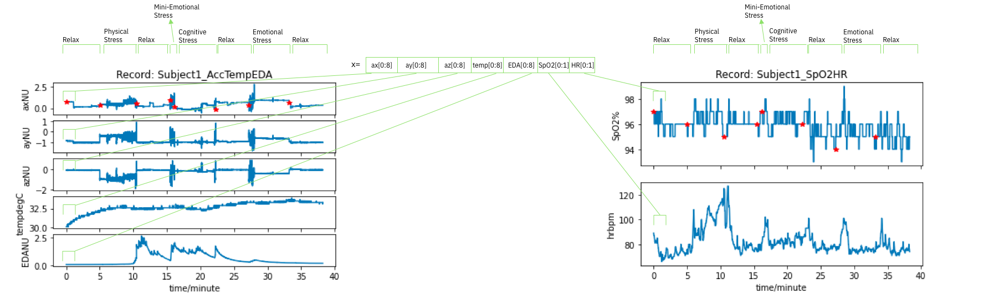

# Assessing Neurological States Using non-EEG Data
The data used in the project is available at https://physionet.org/content/noneeg/1.0.0/
We use non-EEG physiological signals such as accelerometer, temperature, and EDA signals, arterial oxygen level (SpO2) and heart rate signals to classify the state that a patient is in. The feature vector constructed is shown below.

## Feature Vector


We are splitting the signal for each subject into multiple observations. We do this by taking 8 sample from ax, ay, ax, temp, and EDA and 1 sample from SpO2 and HR. We then concatenate all these into one single vector to represent one obervation. The dimension of the vector is 42, 8 values from ax, ay, az, temp, and EDA, which is 40 in total plus 1 observation from SpO2 and one from HR. This is done for all subjects and all stages. The value eta is tunable. For example, if we make eta=16 then we will take 16 observations from from ax, ay, ax, temp, and EDA and 2 sample from SpO2 and HR.

Note: The first readings (i.e. ax, ay, az, temp, EDA) are 8 samples/s while the second readings (i.e. SpO2 and HR) are 1 sample/s therefore we always take 8 times the number of samples from the first reading compared to the second reading.

# References
```
Birjandtalab, Javad, Diana Cogan, Maziyar Baran Pouyan, and Mehrdad Nourani, A Non-EEG Biosignals Dataset for Assessment and Visualization of Neurological Status, 2016 IEEE International Workshop on Signal Processing Systems (SiPS), Dallas, TX, 2016, pp. 110-114. doi: 10.1109/SiPS.2016.27
```
